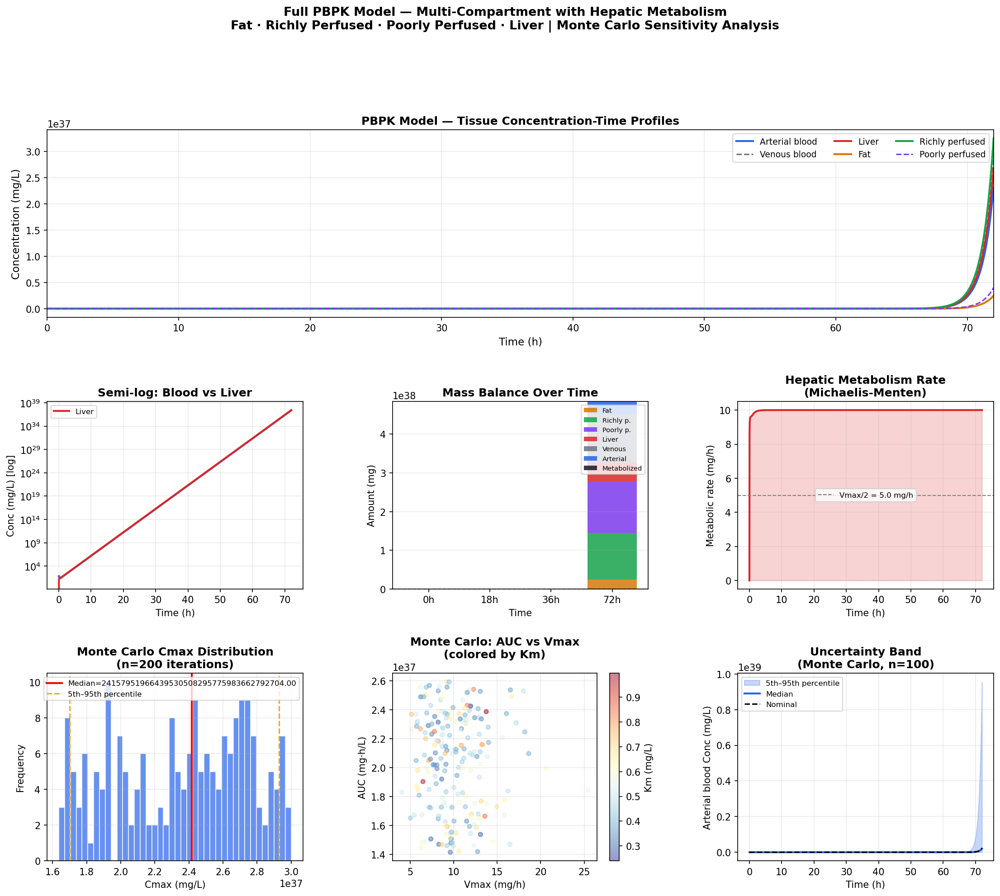

# Full PBPK Model
**Multi-Compartment Physiologically-Based Pharmacokinetic Modeling with Hepatic Metabolism**

## Overview
A complete 4-compartment PBPK model implemented in Python, built following the 
FDA PBPK Modeling Workshop (2024, Dr. Raymond S.H. Yang, Colorado State University).
Models drug disposition through physiologically realistic tissue compartments using 
actual blood flow rates, tissue volumes, and biochemical parameters.

## Model Structure
| Compartment | Description |
|---|---|
| Fat | Lipophilic drug reservoir — slow accumulation |
| Richly perfused | Brain, kidney, heart — rapid equilibration |
| Poorly perfused | Muscle, skin, bone — slow distribution |
| Liver | Hepatic metabolism (Michaelis-Menten kinetics) |

## Features
- Full ODE system with arterial/venous blood distinction
- Michaelis-Menten hepatic metabolism
- Renal elimination
- Mass balance verification
- Monte Carlo uncertainty/variability analysis (n=300)
- 7-panel matplotlib figure
- Interactive Plotly dashboard

## Tools
Python · numpy · scipy · pandas · matplotlib · plotly

## Training Reference
FDA PBPK Modeling Workshop (2024)  
Instructor: Dr. Raymond S.H. Yang, Professor Emeritus, Colorado State University

## Results

## Author
Nadia Tasnim Ahmed, PhD  
Pharmaceutical Data Scientist | LC-MS · PBPK · CMC
